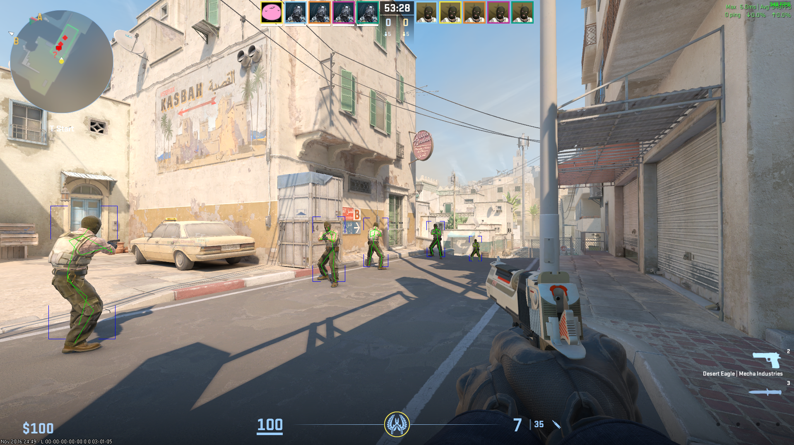
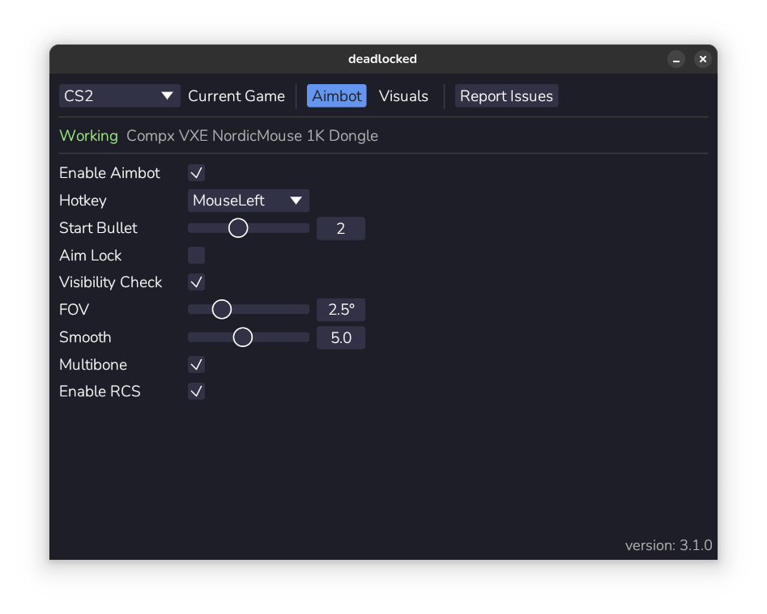
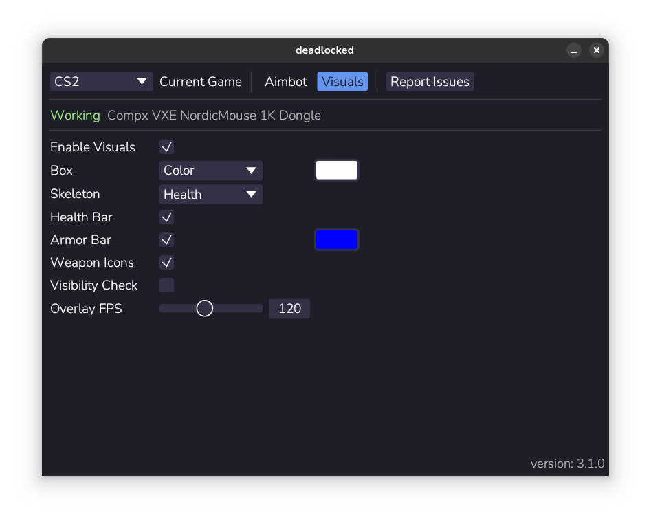

# deadlocked

a very simple cs2 aimbot, for linux only

deadlock support will happen once that gets a native linux client

## setup

- add your user to the `input` group: `sudo usermod -aG input USERNAME` (replace USERNAME with your actual username)
- restart your machine (this will ***not*** work without a restart!)

## running

- if you got the source code from github, run with cargo: `cargo run --release`
- if you got a standalone binary, just run that

## images

### ingame demo

### aimbot settings

### visuals settings

## security

- should be "undetectable", as far as user-space externals go
- completely in user-space
- does not write anything to game memory
- does not need root permissions
